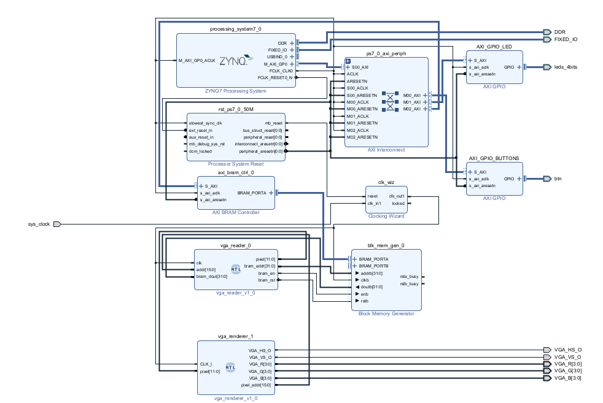

# VGA3
VGA video card implemented in FPGA.  Zybo Z7-20, Vivado 2024.1, and Vitis Classic 2024.1

Reference original template from Digilent: 

https://digilent.com/reference/programmable-logic/guides/getting-started-with-ipi

## Current block disagram

## Case 1

